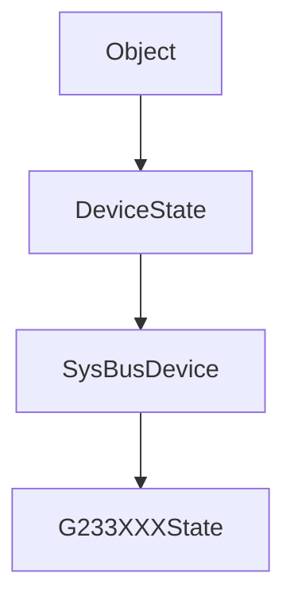
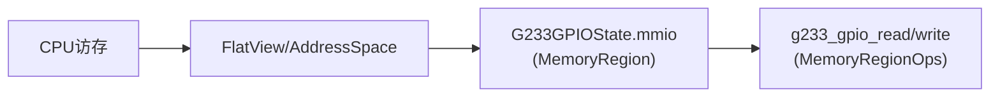
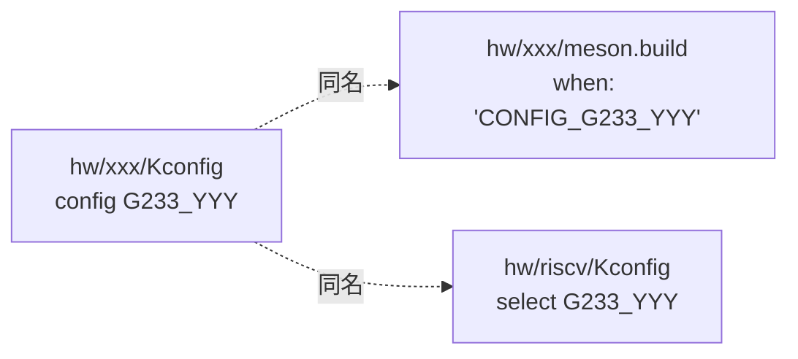

# QEMU 训练营 2026 专业阶段总结

!!! note 主要贡献者

    - 作者：[@serf-huik](https://github.com/serf-huik)

---

## 背景介绍

计算机专业毕业生，对QEMU和虚拟化有一定兴趣，去年了解到了第一期训练营但没有完成学习，希望这次可以跟完全程有所收获。

## 专业阶段

实验选择了SoC方向。学习记录主要为两部分，一部分是从具体实验流程的视角来会看QOM和MemoryRegion等QEMU中的重要概念，另一部分是遇到的一些零碎的细节问题。
### QOM在外设设备添加流程中的体现

每一个外设（`g233_gpio`、`g233_wdt`、`g233_pwm`、`g233_spi`）实际上是QOM（QEMU Object Model）类型系统里的一个**类**，遵循同一套继承链：



`struct G233XXXState`里第一个字段`SysBusDevice parent_obj`，就是C语言里"继承"的实现方式——子类结构体在内存布局上是父类的超集，指针可以安全地在父类/子类之间转换。`TYPE_G233_XXX`字符串是这个类在QOM系统里的"类名"，`TypeInfo`结构体则是这个类的"类描述符"，记录了父类是谁、实例大小多少、class_init函数在哪。

`OBJECT_DECLARE_SIMPLE_TYPE`和`DECLARE_INSTANCE_CHECKER`这两个宏，做的事是生成一个**带类型检查的向下转型函数**（如`G233_GPIO(obj)`），把read/write回调收到的泛型`void *opaque`安全地转换成具体的状态结构体指针。

---

### MemoryRegion与地址空间总线

CPU看到的是统一地址空间（`AddressSpace`），`MemoryRegion`只是其中的一个节点；QEMU会把所有`MemoryRegion`组织成一棵树，并在运行时展开成`FlatView`供访存查询。
`memory_region_init_io`把一段地址范围和一组`MemoryRegionOps`（read/write回调）绑定起来；`sysbus_init_mmio`把这段区域注册为设备的"MMIO输出端口"，machine文件通过`sysbus_create_simple`把这个端口映射到物理地址。



`read`/`write`回调里收到的`addr`是**相对于这段区域起始地址的偏移**，不是绝对物理地址。

---

### sysbus设备创建的三阶段

每个设备从定义到实例化经历三个阶段：


- **realize**：分配"资源"——MMIO区域、IRQ输出线、ptimer实例、子设备（如SPI的两片Flash）。这一步只执行**一次**，相当于构造函数。
- **reset**：初始化"状态"——寄存器复位值、计数器初值。系统每次复位都会重新执行，相当于"回到出厂设置"。
- 理解资源（realize）和状态（reset）的分离。

---

### qemu_irq在设备通信中的理解

`qemu_irq`虽然名字里带IRQ，但本质只是一个“电平信号回调句柄”，既可以表示中断，也可以表示GPIO输入、片选信号（CS）、PWM输出等任意数字线路。`qemu_irq`理解为**任意一条布尔信号线**。`qemu_set_irq(line, level)`表示"驱动方把这条线的电平设为level"。

外设全程都是**驱动方**：
- GPIO/WDT/PWM/SPI → `qemu_set_irq` → PLIC输入线（中断语义）
- SPI控制器 → `qemu_set_irq` → Flash的CS输入线（片选语义，0=选中）

只有当设备需要**接收**一条信号线并据此改变行为时，才需要用`qdev_init_gpio_in`注册一个处理函数，比如在SPI实验里"借用"了m25p80内置的CS处理逻辑。

---

### 其他零碎问题和踩坑

#### 构建系统命名问题：Kconfig与meson的一致性

每新增一个设备，构建链路上有**三个字符串必须完全一致**：



少了`CONFIG_`前缀、或者三处名字不一致，结果都是"文件不会被编译"或"select找不到目标"，且报错信息往往滞后到**运行时**才出现（`unknown type 'xxx'`），而不是编译期。`meson.build`将建构系统和程序连接起来，但程序内的命名一致性是另一个区域（`TYPE_G233_XXX`），二者互不影响。

---
#### 避免电路信号更新漏写

需要另写函数模拟一定组合下的**组合逻辑电路**，只根据**当前寄存器状态**计算输出信号该是什么电平：

```c
level = (条件A) || (条件B) || (条件C);
qemu_set_irq(line, level);
```

如果**这条输出信号的电平由多个寄存器字段共同决定，且这些字段中任意一个发生变化都需要重新评估**，那么为该外设另写函数保证逻辑清晰的同时避免遗漏。函数调用点只需要"状态变了，重新算一下"，不需要每个调用点都重复推导组合逻辑表达式。

- GPIO：IS的变化来自OUT/DIR/TRIG/POL/IE的组合
- SPI的CS：由SPE、MSTR、CR2三个字段共同决定
- SPI的IRQ：由TXEIE/RXNEIE/ERRIE分别与TXE/RXNE/OVERRUN的组合决定

---

#### Resettable接口的迭代更新

QEMU正在从"单一`reset()`回调"迁移到**三阶段Resettable接口**（enter/hold/exit）。三阶段模型主要是为了支持复杂设备树的复位顺序控制，以及多设备之间的依赖关系处理。
`DeviceClass`里仍保留`legacy_reset`字段作为兼容层，但**直接赋值`dc->legacy_reset = fn`不会把这个回调正确挂接到Resettable的执行链路上**——必须通过`device_class_set_legacy_reset(dc, fn)`这个setter函数，它内部会做必要的注册动作。

`device_class_set_legacy_reset(dc, fn)`也是中间态，未来应该会被`ResettableClass`取代，需要多留意API更新。

---

#### ptimer API的使用

`ptimer_set_count`、`ptimer_run`、`ptimer_stop`、`ptimer_set_limit`、`ptimer_set_freq`这些**修改计时器内部状态**的函数，必须包在`ptimer_transaction_begin/commit`之间，否则触发assertion。

这是QEMU为了确定性回放（record/replay）重构ptimer时引入的约束——把多个状态修改打包成一个"原子事务"，确保虚拟时钟的快照/回放在事务边界上是一致的。规则很机械：**只要调用了`ptimer_*`的setter类函数，就检查是否在事务里**，不分是在`realize`/`reset`还是在`read`/`write`/`tick`回调中。

---

#### 头文件include顺序

**`qemu/osdep.h`必须是每个`.c`文件的第一个include**（注释除外）。它引入`<stdint.h>`等基础类型定义，QEMU的其他头文件都假设这些类型已经可用、不会重复include。

---

## 总结

通过 SoC 实验，我对先前基础阶段讲义中介绍的 QEMU 关键概念有了更直观的理解，并了解了外设从建模到接入系统的基本流程，能够将硬件概念与 QEMU 中的具体实现对应起来。